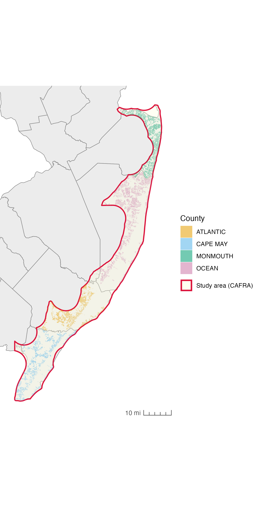
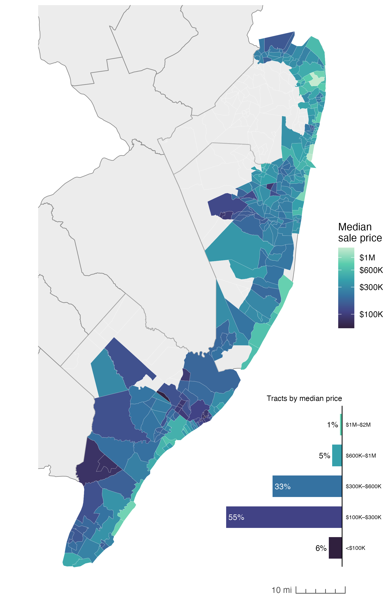
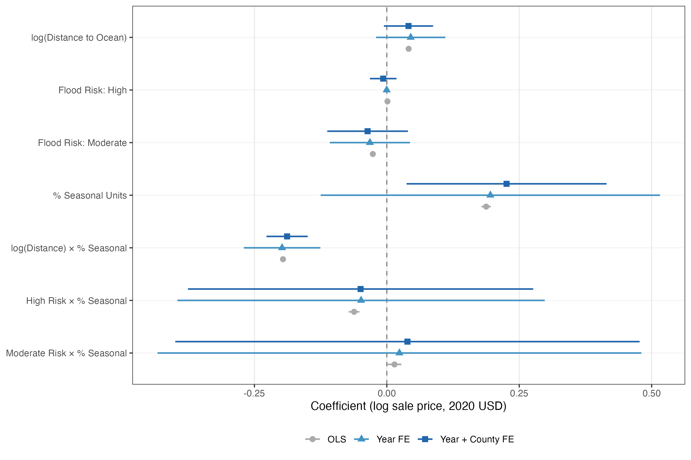

# Flood Lines in Time: Climate Risk Capitalization in the Jersey Shore Housing Market

**Artem Pankin** · MCRP, Rutgers University · Jersey Shore Seminar, Spring 2026

---

> *Do seasonal housing markets price climate risk differently than year-round communities?*

This project investigates the interaction between flood risk, coastal amenity premiums, and the seasonal character of the Jersey Shore housing market using 2.2 million parcel-year observations across Atlantic, Cape May, Monmouth, and Ocean counties (2015–2025). A hedonic regression framework with time and entity fixed effects is applied to identify whether climate risk capitalization differs between seasonal (second homes, short-term rentals) and year-round residential properties.

The analysis is paired with a full-length working paper ([`main.pdf`](main.pdf)).

---

## Key Findings

- **Flood zones are not significantly discounted.** FEMA flood zone designation does not produce a robust negative price effect — consistent with the overvaluation literature (Gourevitch et al., 2023).
- **Coastal proximity commands a premium despite climate risk.** Properties closer to the ocean sell for significantly more, even controlling for assessed value and building age.
- **The seasonality premium is real but spatially bounded.** A higher share of seasonal housing units in a census tract is associated with higher sale prices — but only for properties within approximately **2.6 miles of the shoreline**. Beyond that threshold, the effect reverses.
- **Interaction matters.** The interaction term log(Distance) × % Seasonal is the most robust finding across all model specifications, remaining significant even after introducing year and county fixed effects.

---

## Study Area

The study area follows the New Jersey **Coastal Area Facility Review Act (CAFRA)** boundary — the state's designated coastal planning zone covering the oceanfront portions of four counties.

<p align="center">
  
  
</p>
<p align="center">
  <em>Left: Jersey Shore study area with parcel sample by county. Right: Median sale price by census tract (2023).</em>
</p>

---

## Data

| Source | Description | Scale |
|---|---|---|
| NJ MOD-IV Historical Database | Municipal tax assessor records: sale price, assessed values, building characteristics | ~40.9 M rows, 2010–2025 |
| NJ Statewide Parcels GDB | GIS parcel geometries (`Cad_parcel_mod4`) | 3.48 M parcels |
| FEMA NFHL (2025) | National Flood Hazard Layer — flood zone classifications statewide | Polygon |
| FEMA FRD, Atlantic County (2017) | Flood Risk Database — annualized average loss estimates | Polygon |
| ACS 5-Year Estimates (2013, 2023) | Seasonal housing units and total units by census tract | Tract |
| CAFRA Boundary | NJ coastal planning zone (DEP) | Polygon |
| CPIAUCSL | CPI for inflation adjustment to 2020 dollars | Annual |

All data sources are publicly available. The full parquet pipeline outputs (~15 GB) are not tracked in this repository but can be reproduced by running the notebooks in order.

---

## Pipeline

Notebooks and scripts must be run sequentially — each stage produces outputs consumed by the next.

```
01_processing.ipynb      MOD-IV × GIS join via DuckDB → parcels_modiv_joined.parquet (12.5 GB)
                         CAFRA clip → parcels_shore.parquet (6.1 M rows)

02_features.ipynb        FEMA flood zone spatial join → parcel_flood_features.parquet
                         Interactive folium map of flood zones

03_mod4-eda.ipynb        Exploratory analysis of shore parcels (distributions, sale price
                         persistence, year-over-year patterns)

04_temporalitydata.r     Temporal structure of MOD-IV sale records

05_acs.ipynb             ACS seasonal housing unit share → joined to parcels by census tract

06_sales-adj.ipynb       CPI inflation adjustment → sale_price_2020 column

07_building_desc.ipynb   Parsing MOD-IV building description field

08_cleaning.ipynb        Final cleaning → parcels_shore_clean.parquet

09_owenrship.ipynb       Owner-address vs. parcel-address proxy for seasonality
                         (Pearson r = 0.70 vs. ACS seasonal share)

10_eda-viz.r             EDA visualizations (maps, distributions, bivariate)
11_eda-viz-paper.r       Publication-quality figures for the paper
12_viz-results.r         Coefficient plots, interaction margins, time trends

20_models_hedonic.r      Hedonic regression (OLS → Year FE → Year + County FE →
                         Year + Tract FE) via fixest; LaTeX/PNG table export
```

---

## Model

A pooled cross-sectional hedonic model with fixed effects estimated via `fixest`:

$$\ln(\text{SalePrice}_{it}) = \beta_1 \log(\text{Distance})_i + \beta_2 \text{PctSeasonal}_i + \beta_3 \text{FloodZone}_i$$
$$+ \beta_4 (\text{FloodZone} \times \text{PctSeasonal}) + \beta_5 (\log(\text{Distance}) \times \text{PctSeasonal}) + \boldsymbol{\gamma}'\mathbf{C}_{it} + \alpha_i + \delta_t + u_{it}$$

**Dependent variable**: log of CPI-adjusted sale price (2020 dollars), restricted to market transactions ≥ $20,000.

**Controls**: log assessed land value, log assessed improvement value, building age.

**Fixed effects**: year ($\delta_t$), county ($\alpha_i$). Standard errors clustered at the county or census tract level depending on specification.

**Final sample**: N = 2,246,512 observations. R² = 0.71 (year FE specification).

<p align="center">
  
</p>
<p align="center">
  <em>Coefficient estimates for variables of interest across four model specifications. Point estimates are stable; wide CIs in county-clustered models reflect the small number of clusters (n = 4).</em>
</p>

---

## Tech Stack

**Python**: `geopandas` · `duckdb` · `pyarrow` / `parquet` · `pyogrio` · `folium` · `matplotlib` · `seaborn` · `pandas` · `numpy`

**R**: `fixest` · `tidyverse` · `sf` · `tigris` · `arrow` · `patchwork` · `ggplot2` · `scales`

**Infrastructure**: DuckDB handles the 12.5 GB spatial join and CAFRA clip without materializing data in Python memory. GeoParquet is used for all intermediate spatial outputs. CRS: EPSG:3424 (NAD83 / NJ ftUS) for spatial operations; EPSG:4326 for display.

---

## Reproduce

```bash
# Clone the repo
git clone <repo-url> && cd climate-risk

# Install Python dependencies
pip install geopandas duckdb pyarrow pyogrio folium matplotlib seaborn pandas numpy jupyter

# Install R dependencies
Rscript -e "install.packages(c('tidyverse','fixest','sf','tigris','arrow','patchwork','scales','magick','tinytex'))"

# Run notebooks in order (01 → 09), then R scripts (10 → 12 → 20)
# Large data files (parquet outputs) are not tracked in this repo.
# Source data must be downloaded separately — see the Data section above.
```

---

## Repository Structure

```
.
├── 01_processing.ipynb      # DuckDB join + CAFRA clip
├── 02_features.ipynb        # Flood zone feature engineering
├── 03_mod4-eda.ipynb        # EDA on shore parcels
├── 04_temporalitydata.r     # Sale record temporality
├── 05_acs.ipynb             # ACS seasonality merge
├── 06_sales-adj.ipynb       # CPI adjustment
├── 07_building_desc.ipynb   # Building description parsing
├── 08_cleaning.ipynb        # Final dataset cleaning
├── 09_owenrship.ipynb       # Owner-address seasonality proxy
├── 10_eda-viz.r             # EDA figures
├── 11_eda-viz-paper.r       # Paper-quality EDA figures
├── 12_viz-results.r         # Result figures (coefplot, margins)
├── 20_models_hedonic.r      # Hedonic regression models
├── main.tex / main.pdf      # Working paper
├── data/                    # Source data (large files not tracked)
└── figures/                 # All output figures (PNG, PDF, TeX)
```

---

## Citation

Pankin, A. (2026). *Flood Lines in Time: Temporality and Capitalization of Climate Risk in the Jersey Shore Housing Market*. Jersey Shore Seminar, Rutgers University.

---

## Acknowledgments

Marc Pfeiffer and Daniel Farnsworth provided streamlined access to the NJ Historical MOD-IV database. All data used in this project are publicly available.
